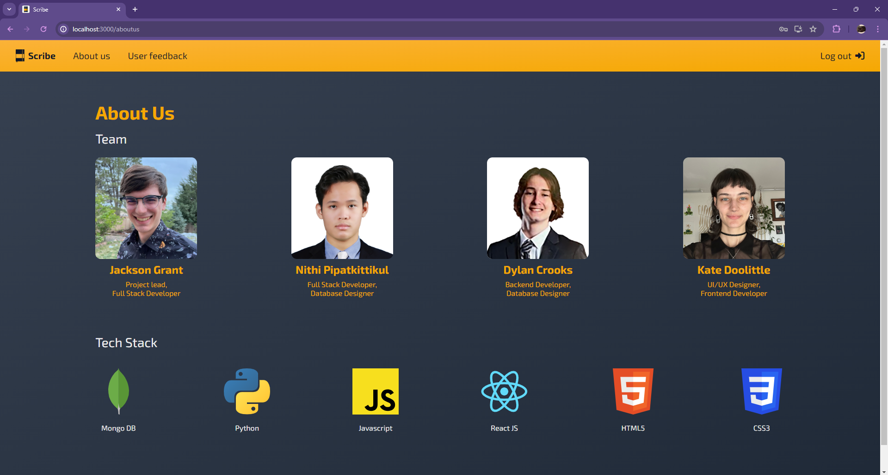

# Scribe

- [Overview](#overview)
  - [Usage](#usage)
  - [Credits](#credits)
- [Demos](#demos)
- [Development Notes](#development-notes)
  - [Requirements](#requirements)
- [Project Setup](#project-setup)
  - [Quick Setup](#quick-setup)
  - [Project Design](#project-design)
  - [Testing](#testing)
- [To-do](#to-do)
  - [Midterm](#midterm)
  - [Final](#final)
    - [Required](#required)
    - [Stretch Goals](#stretch-goals)
- [Known Bugs](#known-bugs)

## Overview

[Project proposal](https://drive.google.com/file/d/16IDP-MVffQDJVVcQPmE3bniw_TpQhXiI/view?usp=sharing)

Scribe is a web app that records audio transcriptions into notes. The goal of this app is to implement an AI model to generate organized and easy-to-read notes from a long audio recording.

The Scribe frontend implements audio recording & transcription, a clean UI, and API integration with the backend. The UI is built with React, and audio transcription is done using the [Azure Speech to Text](https://learn.microsoft.com/en-us/azure/ai-services/speech-service/speech-to-text) service. JavaScript's fetch API is used to communicate with the backend.

The Scribe backend handles user data storage, authentication, and authorization. User data is stored with MongoDB Atlas, and communication to the frontend is done with FastAPI. Research still needs to be done on which AI model to use for synthesizing notes.

### Usage

- When uploading files, only use wav audio files. The Azure STT API cannot process any other type.
  - Several sample files are located at Scribe/Samples/. Conference.wav is the best file for quick testing, while the other two can be used for stress testing.
- The free tier on Azure STT has a limit of 300 minutes of transcription per month. Please be mindful of what you transcribe and don't send files longer than 10 minutes without letting me know.

### Credits


- The project is based on instructor Changhui Xu's [event planner example](https://github.com/changhuixu/CS3980-2024/tree/main/event_planner), particularly on the backend.
- ChatGPT and Github CoPilot were used to help learn the tools used in this project, generate code fragments, and debug.
- The Favicon is the Notebook Flat Icon Vector from [Wikimedia Commons](https://commons.wikimedia.org/wiki/File:Notebook_Flat_Icon_Vector.svg) by Videoplasty.com, CC-BY-SA 4.0.

## Demos

Scribe Notes Demo:
    [](https://www.youtube.com/watch?v=IqGp2SA8YvI)

Scribe Login&Signup Demo:
    [](https://www.youtube.com/watch?v=Cap5FSV4c3I)

Scribe User Feedback Demo:
    [](https://www.youtube.com/watch?v=ynCKYspCr1o)

Screenshot of the about us page:
    

## Development Notes

### Requirements

- Node v20+ [LTS](https://nodejs.org/en/)
- Python 3.12.x

## Project Setup

The below instructions are for quick setup. I have written scripts that install all dependencies and set up environments. If you are worried about running scripts or are encountering issues with them, you can run the commands in the files in terminal yourself.

### Quick Setup

1. Give the scripts permission to run:
    - Windows:
        1. Run ```Set-ExecutionPolicy AllSigned``` in a powershell window as an administrator.
            - If that fails try ```Set-ExecutionPolicy RemoteSigned -Scope CurrentUser -Force```
    - Mac/Linux:
        1. Run ```chmod +x mac-setup.sh be-start.sh fe-start.sh``` in the Scribe folder
2. Insert the API Key for Microsoft Azure STT:
    1. Create a file named .env in the folder Scribe/ScribeFE/scribe-fe.
    2. Paste the following code into the file:  

          ```text
          REACT_APP_SPEECH_KEY="your_key"
          REACT_APP_SPEECH_REGION="eastus"
          ```

    3. Replace the your_key value with the API key I have sent to you.
3. Insert your database credentials
    1. Add your database user [here](https://cloud.mongodb.com/v2/65ff51a50085c37972c4b409#/security/database/users) and your IP address [here](https://cloud.mongodb.com/v2/65ff51a50085c37972c4b409#/security/network/accessList)
        - If you don't have access, please send me the email associated with your MongoDB acccount to be added to the organization.
    2. Create a file named .env in the folder Scribe/ScribeBE.
    3. Paste the following code into the file:

       ```text
        DB_USER="username"
        DB_PASS="password"       
        SECRET_KEY = "secret_key"
       ```

    4. Replace username and password with your user credentials, and replace secret_key with the secret key I have sent you.
4. Run the setup script:
    - Windows:
      1. From the Scribe folder, run ```./windows-setup.ps1``` in VSCode's terminal.
    - Mac/Linux:
      1. From the Scribe folder, run ```./mac-setup.sh``` in VSCode's terminal.
5. Run the project:
    - Windows:
        - Run ```./start.ps1``` from the Scribe folder
    - Mac/Linux:
        1. Run ```./be-start.sh``` from the Scribe folder
        2. Open a new terminal instance
        3. Run ```./fe-start.sh``` from the Scribe folder

### Project Design

The backend is a FastAPI app coordinated by `main.py`. main initiates the app, connects to the database, and coordinates the routers. The models folder contains object models for the API and MongoDB database. The routes folder contains all of the endpoints, organized by router. The database folder contains connection settings and a class for interacting with the database with simpler method calls. The auth folder holds classes used for user authentication and password hashing. 

The frontend is a React app styled with CSS. `app.js` utilizes the react-router-dom library to create a page routing heirarchy. The base code for pages is stored in the components/pages folder, and then they are enhanced with additional components. Styles are imported into components and pages from their respective CSS files in the styles folder. Logos and the index HTML file used to store head tags are located in the public folder.

API calls to the backend are imported into components from `apiService.js` to centralize API logic and security operations and improve code reusability. The base URL for API calls is stored in `apiConfig.js`. `speechRecognizerService.js` is used to make calls to Azure's speech-to-text API to transcribe text.

### Testing

To run tests, run `pytest tests/` from the ScribeBE folder. You will get an error about the log file if you run it from a different folder. Currently, tests cover all endpoints in the backend.

## To-do

### Midterm

- [x] Buttons
  - [x] Create upload file button
  - [x] Create record audio button
  - [x] Deactivate buttons while waiting on API (Needs a loading screen)
- [x] Make API calls to backend
  - [x] Transcription
  - [x] CRUD for notes
- [x] Receive transcribed text from backend
- [x] Create notes from audio transcription
- [x] Edit/delete notes
  - [x] Edit notes
  - [x] Delete notes
- [x] Favicon
- [x] Make full note text readable
- [x] Upload screenshots of app
- [x] Package into one repo
  - [x] Write scripts for setup & startup
  - [x] Consolidate setup scripts for readability

### Final

#### Required

- [x] Database to store user data
  - [x] Notes collection
  - [x] Users collection
  - [x] Feedback collection
  - [x] Audio recordings collection
    - [x] Audio recordings are saved if they are < 15 MB
    - [x] Allow user to listen to the recording in UI
  - [x] Database class to simplify MongoDB commands
- [x] Implement user auth
  - [x] Add user roles
  - [x] Use JWT tokens for auth
  - [x] Create an interceptor to attach JWTs to requests
- [x] Include multiple pages
  - [x] Navbar
  - [x] User registration
  - [x] Home, Sign-in, About Us, Feedback pages
  - [x] Create a feedback form
- [x] Logs are generated by the backend and stored on disk
- [x] Automated backend test coverage
  - [x] Feedback
  - [x] Notes
  - [x] Users
  - [ ] Audio
- [x] Record demos of app
  - [x] User login (Do with network inspector open to show api calls)
  - [x] Notes demo
    - [x] Note CRUD actions
    - [x] Upload/Download a note
  - [x] User feedback form
  - [x] Screenshot all app pages

#### Stretch Goals

- [x] Make it pretty
  - [x] Adjust style for web accessibility standards
  - [x] Notes open up from list in a modal OR turn list into a sidebar
  - [x] Loading screen while notes are being uploaded
- [x] Make setup easy with scripts
- [x] Require .wav files for file upload input
- [x] Loading screen while notes are being transcribed
- [ ] API Calls to LLM to synthesize long texts
  - [ ] LLM can create a summary of the recording
  - [ ] Option to transcribe raw speech or synthesize notes
  - [ ] LLM Generates a note title
  - [ ] Notes display in list with their title
- [ ] Add language identification to record in different languages

## Known Bugs

- As of April 11 2024, Azure STT does not work on Firefox. There does not seem to be a solution to this yet.
