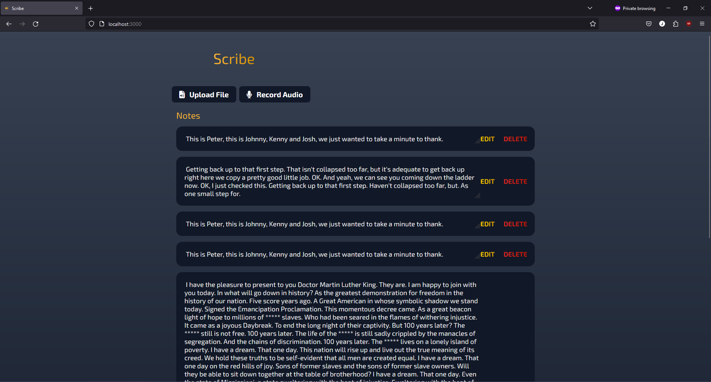
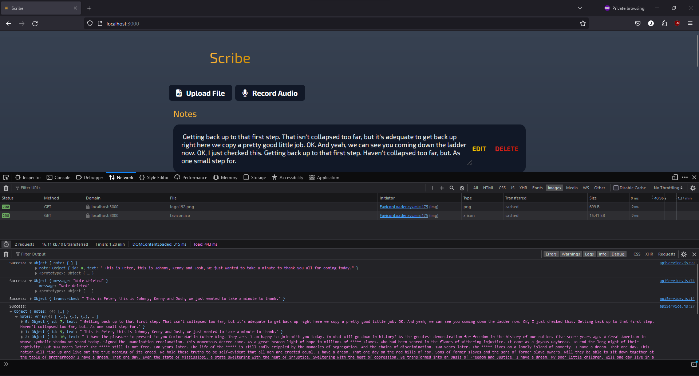
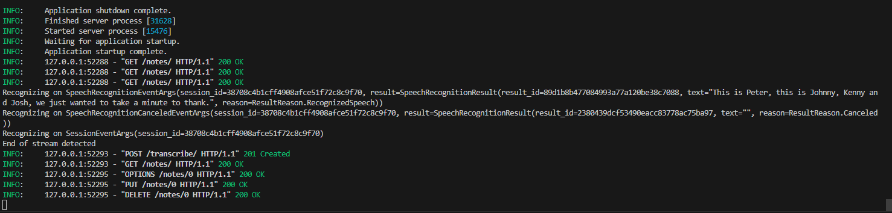

# Scribe

- [Scribe](#scribe)
  - [Overview](#overview)
    - [Usage](#usage)
    - [Credits](#credits)
  - [Demos](#demos)
  - [Development Notes](#development-notes)
    - [Project Design](#project-design)
    - [Requirements](#requirements)
  - [Project Setup](#project-setup)
    - [Quick Setup](#quick-setup)
  - [To-do](#to-do)
    - [Midterm](#midterm)
    - [Final](#final)
  - [Known Bugs](#known-bugs)

## Overview

[Project proposal](https://docs.google.com/document/d/1GdgHPWnze3kT_F590w5CgGXA6Ve6duiCPAWjdjNOQRM/edit?usp=sharing)

Scribe is a web app that records audio transcriptions into notes. The goal of this app is to implement an LLM to generate organized and easy-to-read notes from a long audio recording.

The Scribe frontend implements audio recording, a clean UI, and API integration with the backend. The UI is built with React, and audio recording is done with the [react-media-recorder-2](https://www.npmjs.com/package/react-media-recorder-2). JavaScript's fetch API is used to communicate with the backend.

The Scribe backend handles audio transcription, analysis, and user data storage. Audio transcription is done using the [Azure Speech to Text](https://learn.microsoft.com/en-us/azure/ai-services/speech-service/speech-to-text) service. User storage will be done with MongoDB, and communication to the frontend is done with FastAPI. Research still needs to be done on which LLM to use for synthesizing notes. It will need to have a free tier for API calls to it, and be good at understanding and writing text.

### Usage

- When uploading files, only use wav audio files. The Azure STT API cannot process any other type.
  - Several sample files are located at Scribe/Samples/. Conference.wav is the best file for quick testing, while the other two can be used for stress testing.
- The app will be unusable while uploading audio, which takes about as long as the audio file is. The UI does not indicate this yet.
- The free tier on Azure STT has a limit of 300 minutes of transcription per month. Please be mindful of what you transcribe and don't send files longer than 10 minutes without letting me know.

### Credits

- The template UI code is repurposed from [this](https://www.youtube.com/watch?v=MkESyVB4oUw) task list tutorial by Tyler Potts. It has been updated to work in React.
- The project is also based on instructor Changhui Xu's [to-do app example](https://github.com/changhuixu/CS3980-2024/tree/main/my_todo_app), particularly on the backend.
- ChatGPT and Github CoPilot were used to help learn the tools used in this project, generate code fragments, and debug.
- The Favicon is the Notebook Flat Icon Vector from [Wikimedia Commons](https://commons.wikimedia.org/wiki/File:Notebook_Flat_Icon_Vector.svg) by Videoplasty.com, CC-BY-SA 4.0.

## Demos

CRUD actions:
    [Watch the demo here](https://www.loom.com/embed/1466ae1d1391430f85811b4509db6963?sid=2d92dc7d-2565-473f-86ab-683af466f3fc)

Multiple notes:
    

Network log in frontend:
    

HTTP log in backend:
    

## Development Notes

### Project Design

The backend is a FastAPI app coordinated by `main.py`. main initiates the app, coordinates the router, and holds the transcription endpoints. The endpoints for managing notes are located in `note.py` to avoid cluttering main, but the states and router for notes are imported into main.

All models are stored in `model.py`, currently that is just the model for notes.

`transcriber.py` contains the script for communicating with Azure's speech-to-text API. The method transcribe takes a wav file in and returns the transcription of the file. As a by-product it will save the wav file to the Uploads directory, this may be removed in future versions.

The frontend is a React app styled with CSS. The main page is organized by `index.js` and built out of React components defined in the components folder. Styles are imported into components and pages from their respective CSS files in the styles folder. Logos and the index HTML file used to store head tags are located in the public folder.

API calls to the backend are imported into components from `apiService.js` to centralize API logic and improve code reusability. The base URL for API calls is stored in `apiConfig.js`.

### Requirements

- Node v20.11.0+ [LTS](https://nodejs.org/en/)
- Python 3.12.x

## Project Setup

The below instructions are for quick setup. I have written scripts that install all dependencies and set up environments, as well as create an alias to run the project with one command.

If you are worried about running scripts or are encountering issues with them, you can run the commands in the files in terminal yourself. There are more instructions in the frontend and backend readmes.

Note: I have not tested the scripts for Mac/Linux. It is likely these will fail and you will need to manually configure the project. I am sorry, please reach out if you need help.

### Quick Setup

1. Give the scripts permission to run:
    - Windows:
        1. Run ```Set-ExecutionPolicy AllSigned``` in a powershell window as an administrator.
            - If that fails try ```Set-ExecutionPolicy RemoteSigned -Scope CurrentUser -Force```
    - Mac/Linux:
        1. Run ```chmod +x mac-setup.sh config.sh start.sh``` in the Scribe folder
2. Insert the API Key for Microsoft Azure STT:
    1. Create a file named .env in the folder Scribe/ScribeFE/scribe-fe.
    2. Paste the following code into the file:  

          ```text
          REACT_APP_SPEECH_KEY="your-key"
          REACT_APP_SPEECH_REGION='eastus'
          ```

    3. Replace the your-key value with the API key I have sent to you.
3. Run the setup script:
    - Windows:
      1. From the Scribe folder, run ```./windows-setup.ps1``` in VSCode's terminal.
    - Mac/Linux:
      1. From the Scribe folder, run ```./mac-setup.sh``` in VSCode's terminal.
4. Discard the changes to the config file so the API key does not get committed.
5. Kill the terminal and restart Visual Studio Code.
6. Run the project:
    - Windows:
        - Run ```./start.ps1``` from the Scribe folder
    - Mac/Linux:
        - Run ```startapp``` from the Scribe folder
        - Or run ```./start.sh``` from the Scribe folder

___
If you want to customize the command to start the app, follow these instructions:

Windows:

1. Run ```doskey shortcut-name=.\start.ps1``` every time you open the app and change shortcut-name

Mac/Linux:

1. Run ```nano ~/.bashrc``` (or ```nano ~/.bash_profile``` if that fails)
2. Find the alias startapp
3. Change startapp to whatever you want

## To-do

### Midterm

- [ ] Buttons
  - [x] Create upload file button
  - [ ] Create record audio button
  - [ ] Deactivate buttons while waiting on API (Needs a loading screen)
- [x] Make API calls to backend
  - [x] Transcription
  - [x] CRUD for notes
- [x] Receive transcribed text from backend
- [x] Create notes from audio transcription
- [x] Edit/delete notes
  - [x] Edit notes
  - [x] Delete notes
- [x] Favicon
- [x] Make full note text readable
- [x] Upload screenshots of app
- [x] Package into one repo
  - [x] Write scripts for setup & startup
  - [x] Consolidate setup scripts for readability

### Final

- [ ] Implement user auth
- [ ] Persistent data storage
- [ ] Require .wav files for input
- [ ] Allow user to listen to the recording in UI
- [ ] API Calls to LLM to synthesize long texts
  - [ ] LLM can create a summary of the recording
  - [ ] Option to transcribe raw speech or synthesize notes
  - [ ] LLM Generates a note title
  - [ ] Notes display in list with their title
- [ ] Make it pretty
  - [ ] Notes open up from list in a modal OR turn list into a sidebar
  - [ ] Navbar for sign in/out, about page, and home
- [ ] Add language identification to record in different languages

## Known Bugs

- Textarea for editing notes isn't locked in place - need to remove the ability to drag it around somehow. Haven't done a ton of debugging with it either.
- Recording audio is nonfunctional. It sends a playable wav file to the backend, but the headers are corrupted and Azure cannot transcribe it. I am struggling to find a workaround.
